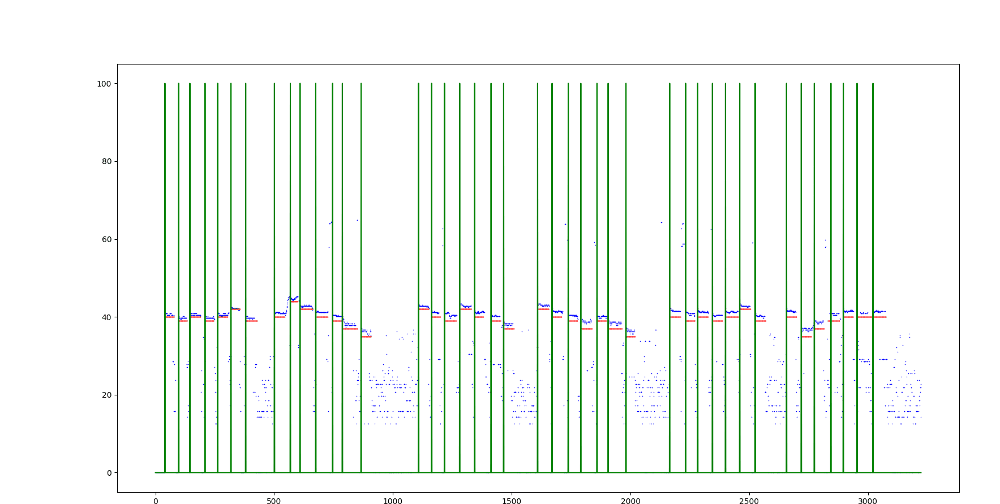

## F0-estimate and onset detect for singing ##
* the project aims to solve F0 estimate and onset detect using mfshs algorithm and CNN for singing.
* the Application scenario include solfege、 Karaoke and  various Monophonic scenes

### include algorithm ###
1.	F0 estimate (similar to yin)
2.	sw alignment
3.	CNN for onset detect
4.	post process by combining the above algorithm

### requirement ###
* tensorflow
* numpy
* librosa

### run ###
```
python main.py
```

onset detection method cite this paper
```
@conference {rgong2018singing,
	title = {Singing voice phoneme segmentation by hierarchically inferring syllable and phoneme onset positions},
	booktitle = {Interspeech 2018},
	year = {2018},
	month = {02/09/2018},
	address = {Hyderabad, India},
	url = {https://arxiv.org/pdf/1806.01665.pdf},
	author = {Rong Gong and Xavier Serra}
}
```

### result ###

